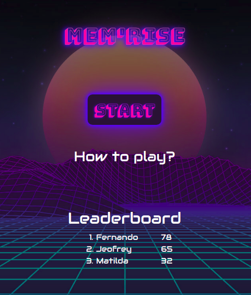
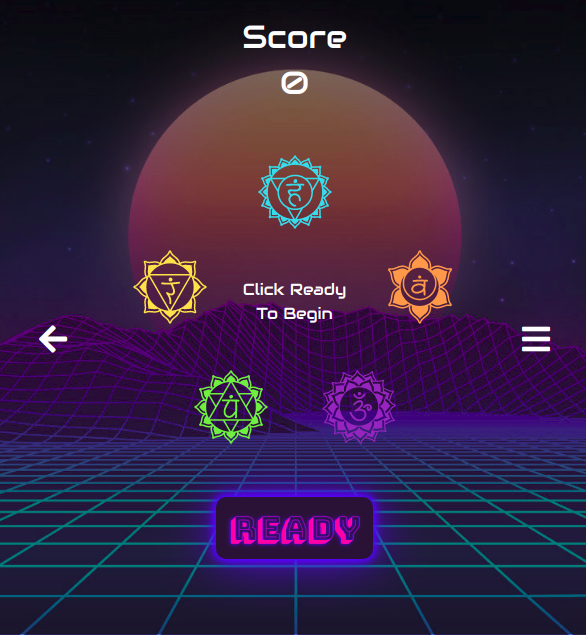
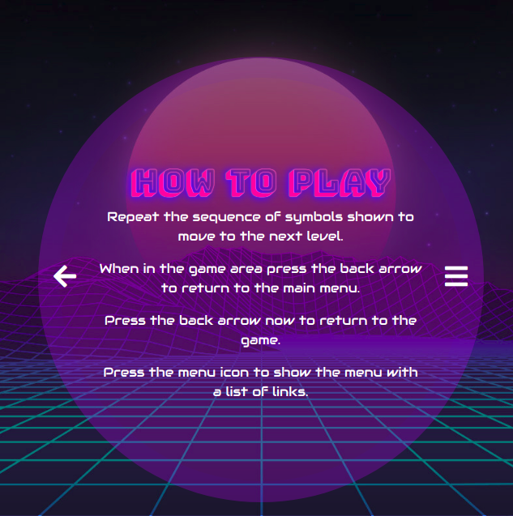
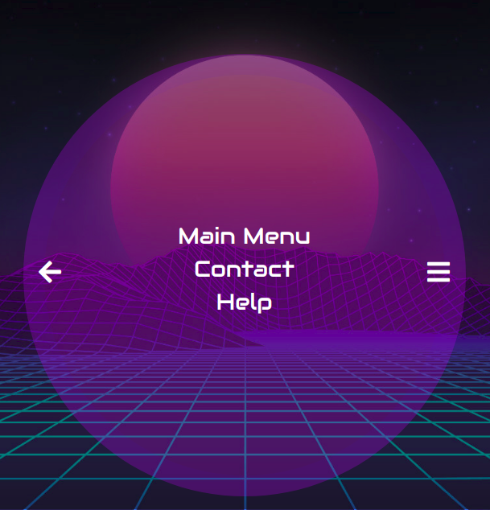
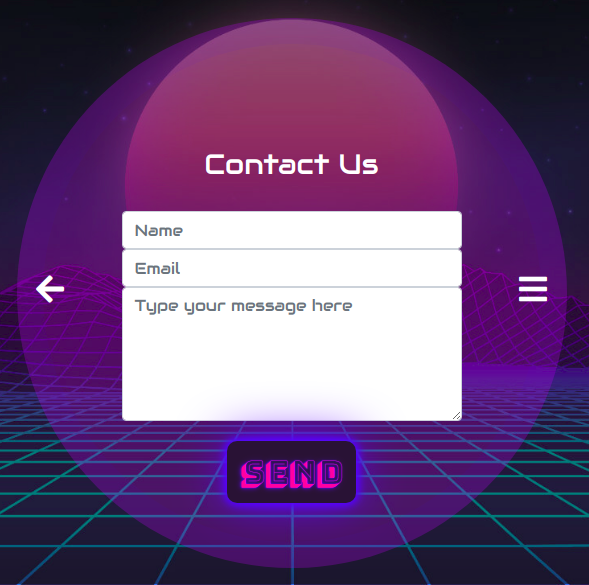

# Mem'rise

[Mem'rise](https://isaacwoodruff.github.io/mem-rise/) is a retro, neon colored memory game for all ages. You must memorise a randomly generated sequence of symbols and try to repeat it. The game combines beautifully crafted animations, fonts, and colors with encouraging messages to provide an engaging user experience.

[View the Mem'rise website here](https://isaacwoodruff.github.io/mem-rise/)

## UX

### Project Goals

The central goal of this project was to create a simple game for all ages that offered a nostalgic experience coupled with a new age design.

#### Player Goals

This game was created for people who have an interest in neon retro futuristic design.

Their goals are:

- A neon pink and blue theme.
- Relevant graphics to retro futurism.
- An engaging experience.
- Intuitive navigation.
- Easy to understand how it works.

[Mem'rise](https://isaacwoodruff.github.io/mem-rise/) met these goals by:

- Designing a color scheme heavily influenced by neon pink and blue colors.
- Implementing a retro futuristic background, and symbols.
- Adding fun and engaging animations.
- Dislaying relevant navigation links and styling them in approriate places.
- Writing an easy to follow How To Play section.
- Designing a smooth navigation flow.
- Programming a simple game.

#### Developer Goals

The developers goals were to:

- Get a stronger grasp on writing code with a more professional focus.
- Gain a more intrinsic understanding of JavaScript, jQuery, and Jasmine.
- Craft a project to a high standard.

### User Stories

#### As a player of [Mem'rise](https://isaacwoodruff.github.io/mem-rise/), I want:
- To play an attractive looking game to keep me focused
- Simple to understand controls, and navigation
- Information on how to use the game, and how to play it
- A sense of achievement when a level is completed
- A heavy influence from the genre of neon, retro futurism

### Wireframes

The wireframes were creating using [Figma](https://www.figma.com).

- #### Current Design
    - [Desktop Display](https://www.figma.com/file/UKqdFUDGyTi9GC6PWotMWKl9/Mem'rise---Memory-Game?node-id=29%3A61) 
    - [Mobile Display](https://www.figma.com/file/UKqdFUDGyTi9GC6PWotMWKl9/Mem'rise---Memory-Game?node-id=28%3A0) 

- #### Old Design
    - [Desktop Display](https://www.figma.com/file/UKqdFUDGyTi9GC6PWotMWKl9/Mem'rise---Memory-Game?node-id=7%3A35) 
    - [Mobile Display](https://www.figma.com/file/UKqdFUDGyTi9GC6PWotMWKl9/Mem'rise---Memory-Game?node-id=0%3A1) 

## Features

### Existing Features

The website is a one page design with the relevant menus/views being displayed at the approriate times based on user interaction.

1. #### Main menu
    **Features:**
    - An animated title of the game
    - A big call-to-action Start button which displays the game view
    - A How To Play link which displays the help menu
    - A Leaderboard with the top scores from fictional players
    - A retro futuristic background image
    - An audio button that can be toggled to play/pause the background music

  

2. #### Game view
    **Features:**
    - A set of 5 symbols that show animations and box shadow effects when clicked
    - A Ready button to begin the game
    - A Continue button to continue to the next move/level
    - A score that updates everytime the player gets a correct move
    - A back arrow which navigates to the main menu
    - A menu icon which brings up a menu with a list of navigation links
    - Positive messages displayed at random each time the player makes a correct move

  

3. #### Help menu
    **Features:**
    - An explanation of how to play the game
    - An explanation of how to navigate through the website
    - A background overlay that changes depending on the screen size

  

4. #### Menu list
    **Features:**
    - A link to the Main menu
    - A link to the Help menu
    - A back arrow which navigates to the main menu
    - A background overlay that changes depending on the screen size
    - An audio button that can be toggled to play/pause the background music

  

5. #### Contact section
    **Features:**
    - This has a form with which the user is able to send a message to the developer
    - It utilises Email.js 

  

### Features Left to Implement

1. #### Leaderboard section
    **Features:**
    - This would have a graph with the user scores, averages, and times played
    - It would utilise D3.js

2. #### Difficulty mode
    **Features:**
    - This would have the option to change the game difficulty between normal and hard
    - Normal mode would be the game as it currently is
    - Hard mode would make all the symbols spin clockwise increasingly the higher score a player has

3. #### Reset button
    **Features:**
    - This button would reset the game at any time the user wants

## Technologies Used

The project uses **JavaScript**, **CSS**, and **HTML** programming languages.

- [Cloud9](https://aws.amazon.com/cloud9/) 
    - The IDE **Cloud9** was used throughout the project for development.
- [JQuery](https://jquery.com)
    - The project uses **JQuery** to simplify DOM manipulation.
- [Jasmine](https://jasmine.github.io/)
    - This project uses **Jasmine** to automatically test all the JavaScript and jQuery code.
- [Jasmine-jQuery](https://github.com/velesin/jasmine-jquery)
    - This project uses **Jasmine-jQuery** to allow Jasmine to test jQuery code.
- [Bootstrap](https://getbootstrap.com/)
    - The project uses the **Bootstrap** framework to help create a responsive design.
- [Git](https://git-scm.com)
    - The project uses **Git** for version control during the development process. 
- [GitHub](https://github.com/)
    - The project uses **GitHub** for a remote repository.
- [Google Fonts](https://fonts.google.com/)
    - The project uses **Google Fonts** to style the fonts in the website.
- [FontAwesome](https://fontawesome.com/)
    - The project uses **FontAwesome** to create navigation icons.
- [Animate.css](https://daneden.github.io/animate.css/)
    - The project uses **Animate.css** to animate the symbols and the game title.
- [Textillate](http://textillate.js.org/) & [Lettering](http://letteringjs.com/)
    - The project uses **Textillate.js** with **Lettering.js** to animate the game title.
- [Figma](https://www.figma.com/)
    - The project used **Figma** to build wireframes in the planning stage of development.
- [Pixlr](https://pixlr.com/)
    - The project used **Pixlr** to add an overlay to the background image which darkened it.
- [AutoPrefixer](https://autoprefixer.github.io/)
    - The project used **AutoPrefixer** to add prefixes in the CSS for cross-browser support.
- [Google Chrome - Dev Tools](https://www.google.com/chrome/)
    - The project used **Google Chrome - Dev Tools** to test responsiveness, to debug code by utilising breakpoints and the console, and to speed up the design process.

## Testing

### Automated Testing

#### Validation Tools

These tools were used to test the validity of the code for this project:
- [W3C HTML Validator]( https://validator.w3.org/) was used to validate HTML.
- [W3C CSS validator](https://jigsaw.w3.org/css-validator/) was used to validate CSS.
- [JSHint](https://jshint.com/) was used to validate JavaScript.

#### Jasmine

[Jasmine.js](https://jasmine.github.io/) was used to test the majority of functions within the JavaScript code. It was used alongside [Jasmine-jQuery](https://github.com/velesin/jasmine-jquery) to allow the use of jQuery within the Jasmine tests.

You can find the deployed Jasmine test page [here](https://isaacwoodruff.github.io/mem-rise/assets/jasmine/jasmine-testing).
You can also find the repositories folder for Jasmine [here](https://github.com/isaacwoodruff/mem-rise/tree/master/assets/jasmine).

### Manual Testing

#### Testing Matrix

A testing matrix was created using a spreadsheet builder in LibreOffice. It details all of the tests to make sure the site is responsive to different screen sizes, devices, and browsers. The testing matrix can be found [here](https://github.com/isaacwoodruff/mem-rise/blob/master/testing-matrix.pdf).

Note: I was unable to properly test the website on a mobile device with Safari. I didn't have access to one and the in-browser, and downloaded emulators I used didn't show any errors that some users were reporting with the Game View section.

### How User Stories Needs Were Met

- The project has a minimal design which combines interesting graphics, shadow effects, and animations. All this makes it a unique and attractive experience to keep the player engaged.
- The navigation and controls were designed with simplicity in mind. By placing them in approriate places and using relevant icons/ calls to action they are very intuitive to understand.
- The project comes equipt with a How To guide which tells the user how to play the game and how to navigate the website.
- Each time the player makes a correct selection and progresses to the next level, they are shown a random positive message which offers them a sense of achievement.
- The project uses a neon, retro futuristic background throughout the game as well as effects and fonts relating to the genre.

### Bugs

A click event listener had been added for the Continue button inside the addCount function so that when the Continue button was visible it would add a click event. Once clicked the Continue button would call the function generateMove then hide itself (the Continue button). But an issue occured were it would generate multiple moves once the Continue button was clicked. This was because it added a click event listener EVERY time my addCount function was called. It basically stacked the click listeners so that if, for example, it had been clicked 3 times previously and was clicked again it would run the code inside the click event listener 4 times causing the generateMove function to be called 4 times instead of 1. The developer realised that the click event listener should just be added when the document loads so it only adds it once.

## Deployment

The AWS IDE, [Cloud9](https://aws.amazon.com/cloud9/) was used to develop the project. The version control system, [Git](https://git-scm.com) was used to commit and track changes. These commits were pushed to the hosting platform [GitHub](https://github.com/) which was used to store the repository, and to deploy the project on [GitHub Pages](https://pages.github.com/) for a live demo. The deployed site is automatically updated through the master branch when new commits are pushed to the repository.

#### The project, [Mem'rise](https://isaacwoodruff.github.io/mem-rise/) was deployed to GitHub Pages according to these instructions:
1. Log into GitHub
2. From the repository list on the side bar to the left, select **isaacwoodruff/mem-rise**.
2. From the menu under the repository name, select **Settings**.
3. Scroll down to the **GitHub Pages** section.
4. Under the **Source** heading click the drop-down menu and from the list select **Master Branch**.
5. [Mem'rise](https://isaacwoodruff.github.io/mem-rise/) is now **deployed** on GitHub Pages.
6. Return to the **Github Pages** section in the **Settings** tab to retrieve the link to the [deployed site](https://isaacwoodruff.github.io/mem-rise/).

#### To run the project locally and create a clone, follow these instructions:
1. Follow [this link](https://isaacwoodruff.github.io/mem-rise/) to the main page of the [isaacwoodruff/mem-rise](https://isaacwoodruff.github.io/mem-rise/) repository.
2. On the right side of the page click the green **Clone or download** button.
3. In the '**Clone with HTTPS**' section, copy the URL for the repository.
4. Open **Git Bash**.
5. Change the current working directory to the location where you want the cloned directory to be made.
6. Type `git clone`, and then paste the URL that was copied in Step 3.

    `git clone https://github.com/isaacwoodruff/littlemorganshostel.git`
    
7. Press **Enter**.

Your local clone is now created. If you would like further documentation on cloning a repository, you can read [Cloning a repository](https://help.github.com/en/articles/cloning-a-repository).

## Credits

### Content
- All text within this project was written by the developer.

##### Code

- The code for adding cross browser functionality by creating the correct prefixes for the CSS was created by using [AutoPrefixer](https://autoprefixer.github.io/).
- The basic structure/ design idea for setting up a memory game like this was recreated using this tutorial from  [mrkaluzny](https://mrkaluzny.com/create-simon-game-in-javascript/).

### Media

- The images from the symbol set in the game view:
    - The yellow symbol was downloaded from [Vexels](https://www.vexels.com/png-svg/preview/164597/solar-plexus-chakra-symbol).
    - The purple symbol was downloaded from [Vexels](https://www.vexels.com/png-svg/preview/163909/crown-chakra-symbol).
    - The orange symbol was downloaded from [Vexels](https://www.vexels.com/png-svg/preview/164539/sacral-chakra-symbol).
    - The blue symbol was downloaded from [Vexels](https://www.vexels.com/png-svg/preview/164628/throat-chakra-symbol).
    - The green symbol was downloaded from [Vexels](https://www.vexels.com/png-svg/preview/164284/heart-chakra-symbol).

- The background image was downloaded from [CellCode](https://i2.wp.com/singularityhub.com/wp-content/uploads/2017/10/futuristic-retro-landscape-digital-sun-setting-desert-80s-696426469-internet-archive.jpg).

### Acknowledgements

- I gained a deeper understanding of **Scopes** and **Closures** in JavaScript from this video tutorial [Understanding Variable Scope & Closures Without Losing your Mind](https://www.youtube.com/watch?v=iSlSxDNarDY).
- I also gained a better understanding of the **Call Stack**, **Event Queue**, **timeouts**, **loops**, and about **Scope** from this article [Thrown for a loop: understanding for loops and timeouts in JavaScript](https://www.freecodecamp.org/news/thrown-for-a-loop-understanding-for-loops-and-timeouts-in-javascript-558d8255d8a4/).
    
- I received inspiration for this project from this minimal memory game called [circles](https://beautifulpixels.com/game/circles-is-an-elegant-and-minimal-memory-game/).

Thanks to:

- My Code Institute Mentor Mark Railton for his advise throughout the development process.
- To all of the Code Institutes Slack community for helping with my issues, reviewing my code, and giving me tips.